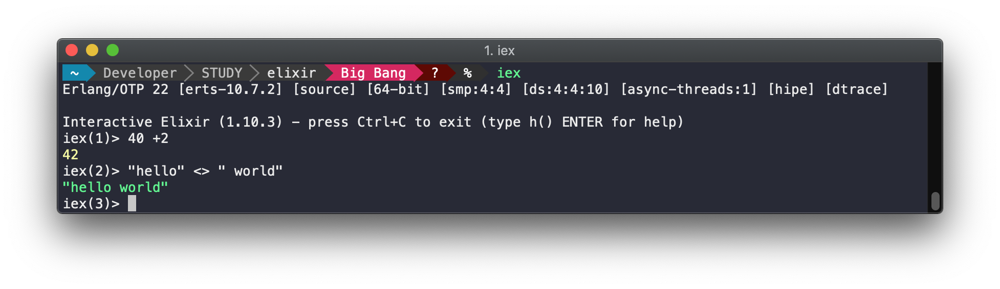
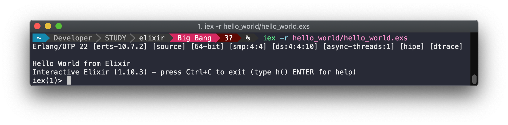
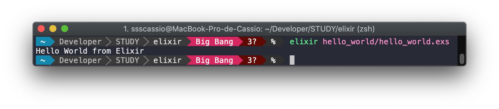

=========

_Data do estudo: 16/05/2020_

__Tema:__ Introdução ao Elixir

### Referências: 
- [Overview do Elixir](https://elixir-lang.org/)
- [Instalação do Elixir - MacOS](https://elixir-lang.org/install.html#macos)
- [Getting Started - Introduction](https://elixir-lang.org/getting-started/introduction.html)
- [Executando script com iex -S](https://groups.google.com/forum/#!msg/elixir-lang-talk/8VejRgYw2hQ/n-f7tvolEQAJ)

------

## Instalação

- Elixir v1.10 requer Erlang 21.0. Caso o Erlang não seja instalado automáticamente durante o processo de instalação
verificar o tutorial de [Instalação do Erlang](https://elixir-lang.org/install.html#installing-erlang).

```shell
brew update
brew install elixir
```

- Verificando instalação:

```shell
elixir --version
```

### Setando variável de ambiente

- Adicionar ao final do seu arquivo de shell (ex.: ~/.zshrc)

```shell
export PATH="$PATH:/path/to/elixir/bin"
```

## Executando

### Modo Interativo:

```
iex
```

- Hello World:



### Script via modo Interativo:

```
iex -r scrip1.exs
```



- _Nota: A documentação cita a execução utilizando `iex -S SCRIPTNAME`, porém isso se trata da execução de scripts no seu `PATH`. É util para executar um comando mix no modo iterativo, ex: `iex -S mix run`._

### Script via executável `elixir`

```
elixir scrip1.exs
```

