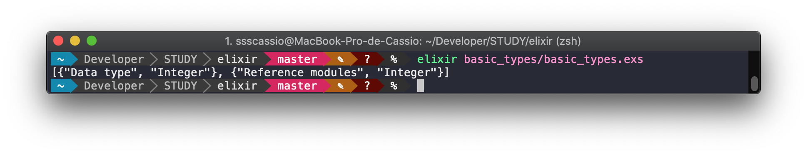
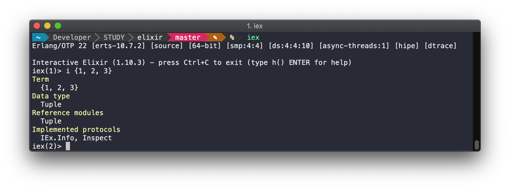
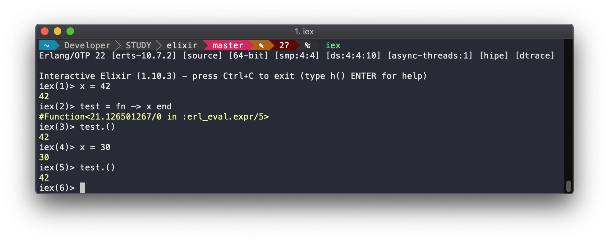
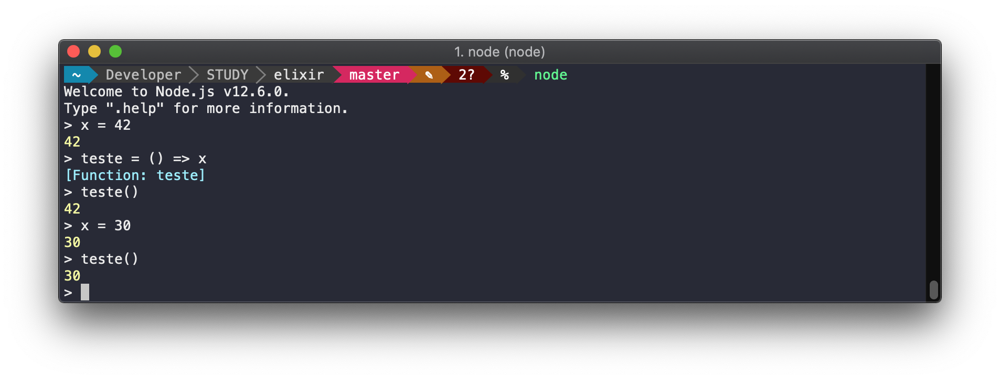

------
_Data do estudo: 16/05/2020_

__Tema:__ Introdução ao Elixir

### Referências: 
- [Overview do Elixir](https://elixir-lang.org/)
- [Instalação do Elixir - MacOS](https://elixir-lang.org/install.html#macos)
- [Getting Started - Introduction](https://elixir-lang.org/getting-started/introduction.html)
- [Executando script com iex -S](https://groups.google.com/forum/#!msg/elixir-lang-talk/8VejRgYw2hQ/n-f7tvolEQAJ)


## Instalação

- Elixir v1.10 requer Erlang 21.0. Caso o Erlang não seja instalado automáticamente durante o processo de instalação
verificar o tutorial de [Instalação do Erlang](https://elixir-lang.org/install.html#installing-erlang).

```shell
brew update
brew install elixir
```

- Verificando instalação:

```shell
elixir --version
```

### Setando variável de ambiente:

- Adicionar ao final do seu arquivo de shell (ex.: ~/.zshrc)

```shell
export PATH="$PATH:/path/to/elixir/bin"
```

## Executando

### Modo Interativo:

```
iex
```

- Hello World:


### Script via modo Interativo:

```
iex -r scrip1.exs
```


- _Nota: A documentação cita a execução utilizando `iex -S SCRIPTNAME`, porém isso se trata da execução de scripts no seu `PATH`. É util para executar um comando mix no modo iterativo, ex: `iex -S mix run`._

### Script via executável `elixir`:

```
elixir scrip1.exs
```


------
_Data do estudo: 16/05/2020_

__Tema:__ Tipos Básicos; Funções; Átomos

### Referências: 
- [Getting Started - Basic types](https://elixir-lang.org/getting-started/basic-types.html)
- [Verificando tipo de um variável](https://stackoverflow.com/questions/28377135/how-do-you-check-for-the-type-of-variable-in-elixir)
- [O que é String Interpolation](https://en.wikipedia.org/wiki/String_interpolation)
- [Strings em Elixir - Detalhamento sobre lista de caracteres e sequência de bytes](https://elixirschool.com/pt/lessons/basics/strings/#listas-de-caracteres)
- [Como documentar em Elixir - Module Attributes](https://hexdocs.pm/elixir/writing-documentation.html#module-attributes)
- [Como funciona a compilação no Elixir e diferença entre elixir e elixirc](https://medium.com/@fxn/how-does-elixir-compile-execute-code-c1b36c9ec8cf)


## Tipos básicos
```
iex> 1          # integer
iex> 0x1F       # integer
iex> 1.0        # float
iex> true       # boolean
iex> :atom      # atom / symbol
iex> "elixir"   # string
iex> 'elixir'   # list
iex> [1, 2, 3]  # list
iex> {1, 2, 3}  # tuple
```
- _Nota: Diferentemente de javaScript `'elixir'` possui uma tipagem diferente de `"elixir"` sendo o primeiro uma **Lista de caracteres (Unicode)** e o segundo um **BitString (UTF-8)**_

### Inspecionando uma variável:

**Script (Debug)**
```
IO.inspect(IEx.Info.info(5))
```


**Modo interativo**
```
iex> i {1, 2, 3}
```



## Funções

Funções são identificadas por seu nome (_name_) e sua aridade (_arity_). A aridade de uma função indica quantos argumentos a função recebe.

```
round/1     # Função que arredonda um número 
round/2     # Função não existente
```

Funções nomeadas podem ser chamadas com ou sem parênteses

```
iex> div(10, 2)
iex> div 10, 2
iex> round (13.5)
iex> round 13.5
```

- Para ver a documentação da função nomeada, usa-se a função **h** seguido do **name/arity** de uma função. ex.: ```h round/1```


## Atoms
É uma constante cujo valor é o seu próprio nome. Outras linguagem chamam de symbols.

São muitas vezes usados para expressar o estado de uma operação, ao usar valores como: `:ok` e `:error`.

- True e false também são átomos
```
iex> true == :true    # true
iex> true === :true   # true
iex> is_atom(false)   # true
```


## String

Interpolação de String (String Interpolation) é permitida para facilitar a formatação de um texto. Semelhante a ecmascript, porém, ao invés de usar `${}` usa-se `#{}`.

```
iex> "hello #{:world}"            # "hello world"
iex> "hello #{"another world"}"   # "hello another world"
```

- _Nota: Para verificar se uma variável é uma string ou não é utilizado a função `is_binary/1` ao invés de uma suposta `is_string/1`._
## Funções anônimas

Exemplo:
- Javascript
```js
add = (a, b) => a + b;
add(1,2)
```
- Elixir
```elixir
add = fn a, b -> a + b end
add.(1,2)
```

- _Nota: É necessário utilizar o (.) após o nome da variável (add). Isso é necessário para evitar ambiguidade entre chamar a função anonima armazenada na variável `add` e uma função nomeada `add/2`._

Uma função anônima mantém o escopo de quando foi declarada, no exemplo a seguir, a variável utilizada pela função anônima vai ter seu valor alterado após a declaração da função, porém o valor retornado pela função continua sendo o valor da variável no momento de sua declaração.

- Exemplo em Elixir


- Comparação com o resultado em javascript.


- _Nota: Estruturas de dados em Elixir são imutáveis. Por exemplo, remover ou concatenar elementos de uma lista retorna uma nova lista_

- _Nota fora de contexto: A extensão do arquivo não importa, .ex e .exs são apenas convenções._

------
